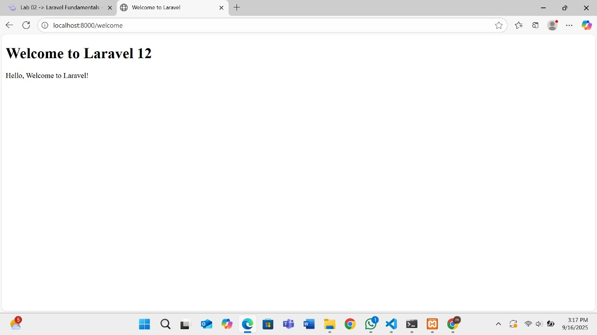
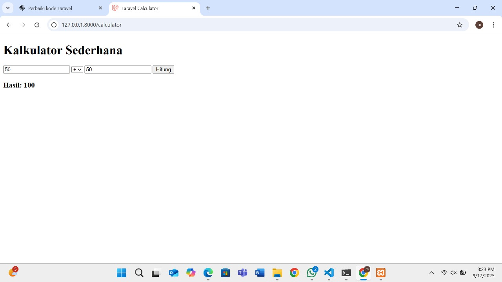
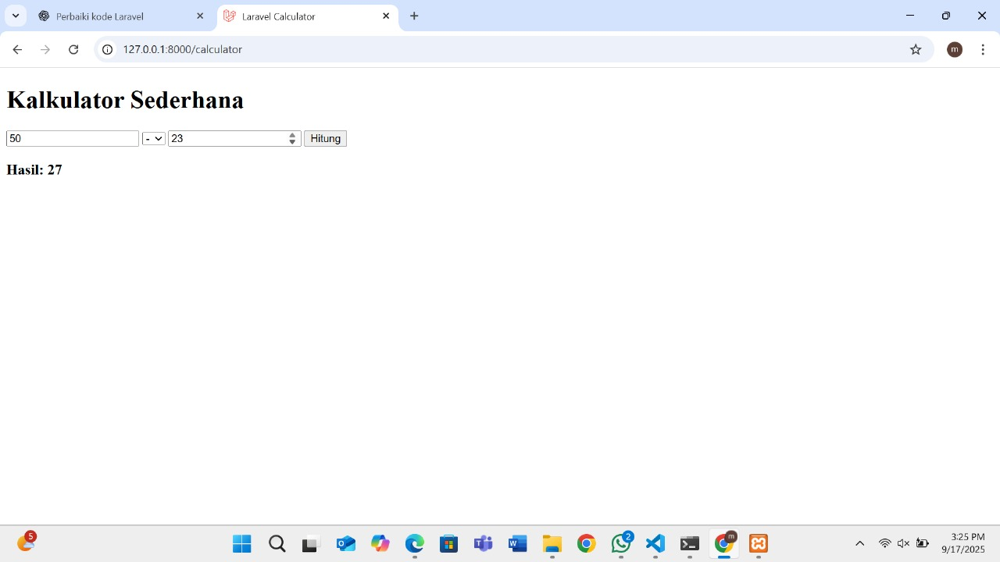
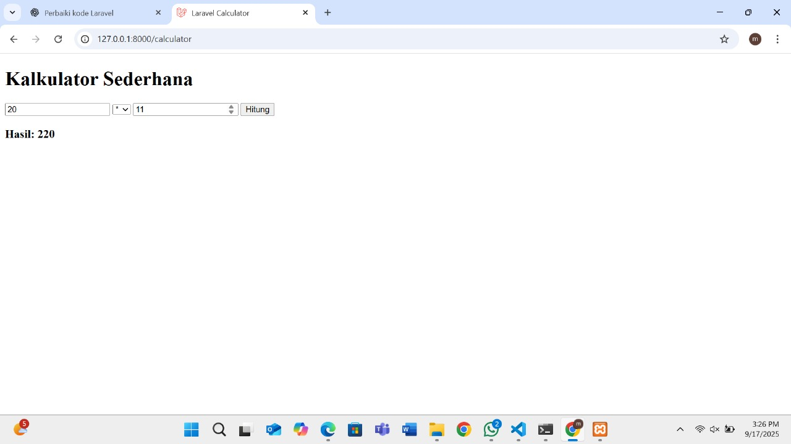
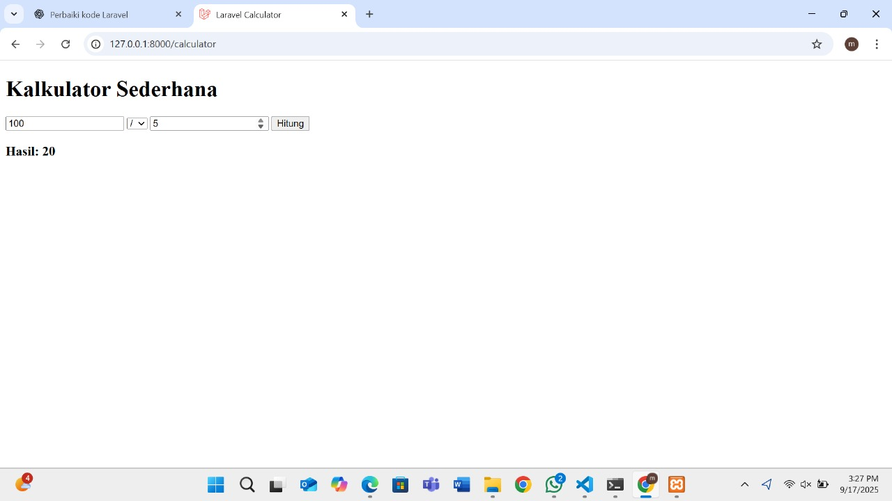

# Laporan Modul 2: Laravel Fundamentasl
**Mata Kuliah:** Workshop Web Lanjut   
**Nama:** [Maisha Zahrani]  
**NIM:** [2024573010052]  
**Kelas:** [TI-2C]  

---

## Abstrak 
Laporan ini membahas dasar-dasar penggunaan framework Laravel, khususnya pada konsep MVC (Model–View–Controller), routing, middleware, serta cara Laravel menangani request dan response. Selain itu, laporan juga menjelaskan peran controller dan view dalam aplikasi, serta penggunaan Blade Templating Engine untuk mengelola tampilan. Tujuan pembuatan laporan ini adalah agar mahasiswa memahami alur kerja Laravel serta dapat mengimplementasikan route, controller, dan view melalui praktikum sederhana, termasuk pembuatan aplikasi kalkulator.

---

## 1. Dasar Teori
MVC adalah singkatan dari Model–View–Controller, sebuah pola arsitektur perangkat lunak yang digunakan untuk memisahkan concern dalam aplikasi web:
- Model: Merepresentasikan data dan logika bisnis. Dalam Laravel, biasanya ditangani oleh Eloquent models yang berinteraksi dengan database.
- View: Menangani lapisan presentasi — yaitu HTML yang ditampilkan kepada pengguna. Laravel menggunakan Blade sebagai template engine untuk view.
- Controller: Mengatur alur antara model dan view. Controller menerima input dari pengguna (melalui route), memprosesnya (seringkali melibatkan model), dan mengembalikan view atau respons yang sesuai.

Konsep Routing di Laravel:
Routing di Laravel mendefinisikan bagaimana aplikasi merespons permintaan (request) yang masuk. Routing memetakan URI ke aksi controller atau closure. Route di Laravel didefinisikan di file routes/web.php untuk permintaan web dan di routes/api.php untuk route API.

Fungsi Middleware:
- Peningkatan Produktivitas:  Middleware mengotomatiskan tugas-tugas umum seperti transformasi data dan routing pesan, sehingga developer dapat fokus pada pengembangan fitur inti aplikasi.
- Integrasi Sistem yang Lebih Mudah:  Middleware menyederhanakan proses menghubungkan aplikasi yang berbeda, baik yang dikembangkan internal maupun eksternal. Ini memungkinkan bisnis untuk membangun ekosistem perangkat lunak yang terintegrasi dengan baik.
- Keamanan yang Ditingkatkan:  Middleware tertentu dapat membantu menegakkan kebijakan keamanan, seperti autentikasi pengguna dan otorisasi akses data. Ini berperan penting dalam melindungi sistem dari ancaman siber.
- Skalabilitas yang Lebih Baik:  Middleware dapat membantu sistem menangani peningkatan beban kerja dengan merutekan permintaan ke server yang tersedia dan mengelola antrean pesan secara efisien.

Cara Laravel menangani Request dan Response.
1. Mengakses Data Request
- kita dapat mengakses data request menggunakan objek request.
- kita juga dapat dengan mudah mengakses parameter query, data form, dan payload JSON (dalam controller atau route clousure atau menggunakan helper).
2. Form Request
- Laravel memungkinkan kita untuk memvalidasi dan mengotorisasi data request yang masuk melalui class form request: php artisan make:request StoreUserRequest
3. Mengembalikan Respon
- Laravel menyediakan cara sederhana untuk mengembalikan response. Kita dapat mengembalikan string, view, JSON, atau bahkan file download. Laravel juga mendukung response dalam bentuk JSON, redirect, file download, dan lainnya.

Peran Controller dan View.
- Controller berperan sebagai penghubung antara pengguna (user) dengan sistem. Controller menerima input dari user (misalnya melalui form atau URL), lalu memprosesnya dengan memanggil data dari Model, dan akhirnya menentukan tampilan apa yang harus dikirimkan ke View. Intinya, Controller adalah "otak" yang mengatur alur aplikasi.

- View berperan untuk menampilkan data atau hasil yang sudah diproses Controller kepada user. View biasanya berupa halaman antarmuka (HTML, Blade template di Laravel, dll). View tidak melakukan logika bisnis yang rumit, melainkan hanya fokus pada penyajian informasi.

Singkatnya: Controller mengatur logika & alur aplikasi, sedangkan View menampilkan hasilnya kepada pengguna.

Fungsi Blade Templating Engine:
- Memisahkan logika dan tampilan 
Blade membantu menjaga kode tetap rapi dengan memisahkan kode PHP dari HTML, sehingga mudah dibaca dan dikelola.

- Mendukung pewarisan layout (template inheritance) 
Dengan @extends, @section, dan @yield, Blade memungkinkan penggunaan layout induk (master) agar halaman web konsisten dan tidak perlu menulis ulang struktur HTML.

- Menyediakan directive khusus 
Blade memiliki directive seperti @if, @foreach, @csrf, @auth dll., yang memudahkan penulisan logika tanpa harus menulis PHP murni.

- Keamanan otomatis 
Saat menampilkan data dengan {{ $variable }}, Blade otomatis melakukan escaping untuk mencegah serangan XSS, kecuali menggunakan {!! !!} untuk menampilkan HTML mentah.

- Efisiensi dan performa 
Blade tidak memperlambat aplikasi karena setiap file Blade dikompilasi menjadi PHP murni sebelum dijalankan, sehingga cepat dieksekusi.

---

## 2. Langkah-Langkah Praktikum
Tuliskan langkah-langkah yang sudah dilakukan, sertakan potongan kode dan screenshot hasil.

2.1 Praktikum 1 – Route, Controller, dan Blade View

- Tambahkan route pada routes/web.php.
- Buat controller WelcomeController.
- Buat view mywelcome.blade.php.
- Jalankan aplikasi dan tunjukkan hasil di browser.

2.2 Praktikum 2 – Membuat Aplikasi Sederhana "Calculator"

- Tambahkan route untuk kalkulator.
- Buat controller CalculatorController.
- Tambahkan view calculator.blade.php.
- Jalankan aplikasi dan coba dengan beberapa input berbeda.

---

## 3. Hasil dan Pembahasan
Jelaskan apa hasil dari praktikum yang dilakukan.
- Apakah aplikasi berjalan sesuai harapan? 
Iya, aplikasi berjalan dengan lancar ketika pengguna memasukkan input dengan benar.

- Apa yang terjadi jika ada input yang salah (misalnya pembagian dengan 0)? 
Jika terjadi kesalahan input, misalnya pembagian dengan angka nol, aplikasi menampilkan pesan error sesuai validasi Laravel.

- Bagaimana validasi input bekerja di Laravel? 
Validasi input di Laravel mempermudah developer karena dapat dilakukan langsung di controller atau melalui Form Request.

- Apa peran masing-masing komponen (Route, Controller, View) dalam program yang dibuat? 
Masing-masing komponen memiliki peran penting: route menentukan jalur permintaan, controller memproses logika, dan view menampilkan hasilnya.

---

## 4. Kesimpulan

Dari praktikum ini bisa dilihat kalau Laravel memang memudahkan kita dalam membuat aplikasi web. Konsep MVC-nya jelas, routing-nya gampang diatur, dan middleware membuat aplikasi lebih aman. Blade juga membantu supaya tampilan lebih rapi, simpel, dan konsisten. Praktikum kalkulator yang kita buat jadi bukti kalau route, controller, dan view bisa saling kerja sama untuk menghasilkan aplikasi yang dinamis.

---

## 5. Referensi
1. fungsi middleware https://www.codepolitan.com/blog/apa-itu-middleware-pengertian-contoh-dan-fungsinya/
2. peran controller dan view https://chatgpt.com
3. Fungsi Blade Templating Engine https://chatgpt.com/

---
