# Laporan Modul 3: Laravel Controller
**Mata Kuliah:** Workshop Web Lanjut   
**Nama:** Maisha Zahrani  
**NIM:** 2024573010052  
**Kelas:** TI-2C 

---

## Abstrak 

Laporan ini membahas cara kerja Controller di Laravel yang digunakan untuk mengatur alur antara route, model, dan view. Dalam praktikum ini, dibuat beberapa proyek untuk mempelajari bagaimana controller menampilkan halaman, mengelompokkan rute, dan memisahkan bagian admin serta user. Hasilnya, penggunaan controller membuat kode lebih rapi, mudah diatur, dan membantu proses pembuatan aplikasi web menjadi lebih cepat dan terstruktur.

---

## 1. Dasar Teori
Apa itu Controller? controller adalah kelas PHP yang bertanggung jawab untuk memproses permintaan HTTP dari pengguna dan mengembalikan respons yang sesuai. Controller menyatukan logika aplikasi dan memastikan bahwa permintaan dari pengguna diarahkan dengan benar ke model yang sesuai atau ke tampilan yang tepat.

Jenis-jenis Controller pada Laravel:
1. Basic Controllers (Controller Dasar)
Kelas standar dengan banyak metode untuk berbagai endpoint.
2. Resource Controllers (Controller Sumber Daya)
Cocok untuk operasi CRUD menggunakan konvensi RESTful.
3. Invokable Controllers (Controller yang Dapat Dipanggil)
Berguna untuk endpoint yang berisi satu aksi saja.
4. Pengelompokan Rute dengan Controller
5. Injeksi Permintaan dan Injeksi Ketergantungan
6. Validasi Permintaan dalam Controller
7. Mengembalikan Respons dari Controller
Controller dapat mengembalikan berbagai jenis respons: 
  - view
  - JSON
  - redirect
  - respon kustom
 
Peran Utama Controller
- Routing yang Terkelola Baik: 
Controller memungkinkan Anda untuk mengelola rute dengan lebih terstruktur. Dengan menetapkan fungsi-fungsi tertentu dalam controller, Anda dapat dengan mudah menghubungkan rute aplikasi dengan tindakan-tindakan (actions) yang sesuai dalam controller.

- Logika Bisnis Terpusat: 
Controller adalah tempat di mana logika bisnis aplikasi Anda disimpan. Ini membantu dalam memisahkan logika aplikasi dari tampilan, membuat kode lebih bersih dan mudah dipelihara.

- Interaksi dengan Model dan Database: 
Controller memfasilitasi interaksi antara aplikasi Anda dengan database melalui model. Dengan menggunakan model, Anda dapat melakukan operasi database seperti pengambilan data, penyimpanan, pembaruan, dan penghapusan.

- Pengelolaan Tampilan yang Efisien: 
Controller membantu dalam memilih tampilan yang sesuai untuk ditampilkan kepada pengguna berdasarkan logika aplikasi. Ini memastikan bahwa pengguna melihat informasi yang relevan dan diperbarui.

---

## 2. Langkah-Langkah Praktikum
Tuliskan langkah-langkah yang sudah dilakukan, sertakan potongan kode dan screenshot hasil.

2.1 Praktikum 1 – Menangani Request dan Response View di Laravel 12

1. Buat dan Buka Proyek Laravel
composer create-project laravel/laravel:^12.0.3 lab-view
cd lab-view
code .

2. Buat sebuah Controller php artisan make:controller DemoController

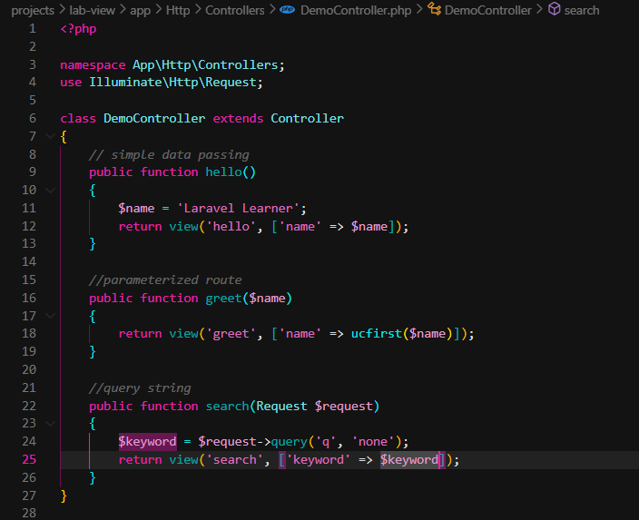

3. Definisikan Rute, edit routes/web.php

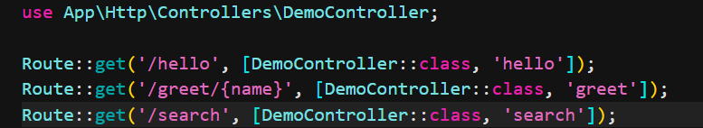

4. Buat View Sederhana hello.blade.php, greet.blade.php, search.blade.php

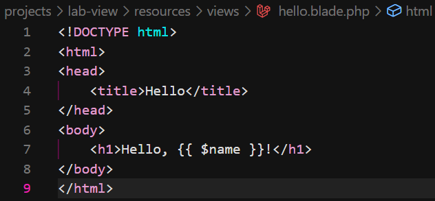
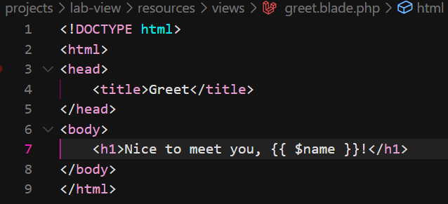
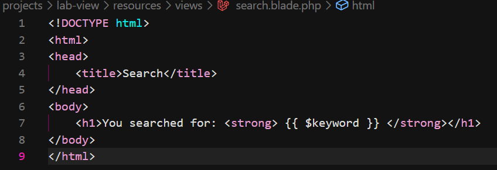

5. Jalankan aplikasi dan coba dengan beberapa input berbeda.

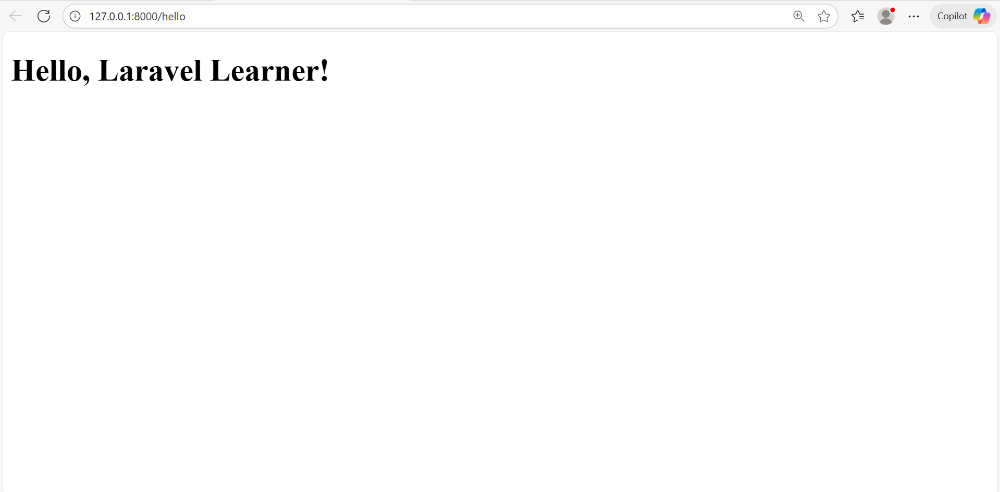
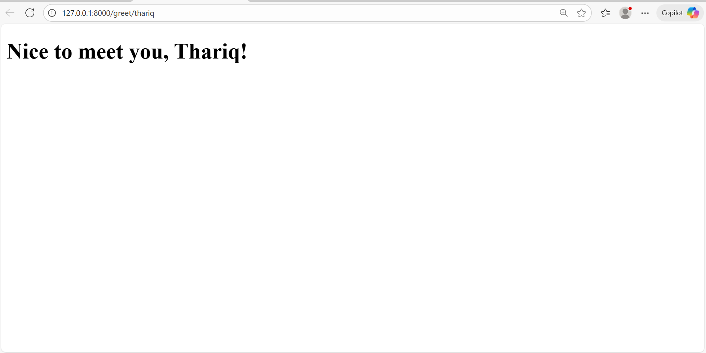

2.2 Praktikum 2 – Menggunakan Group Route

1. Buat dan Buka Proyek Laravel
composer create-project laravel/laravel:^12.0.3 lab-group
cd lab-group
code .

2. Buat sebuah Controller php artisan make:controller PageController

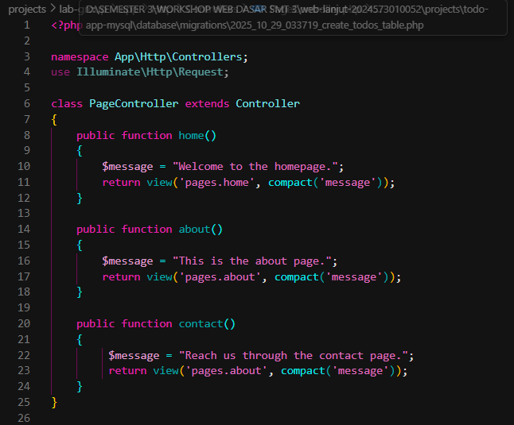

3. Definisikan Rute, edit routes/web.php

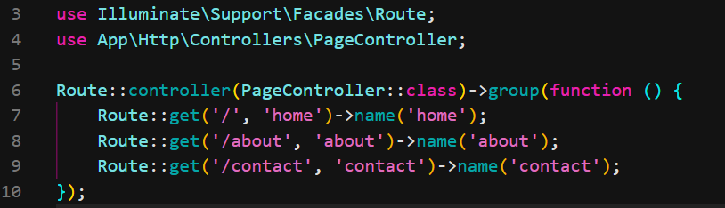

4. Buat View Sederhana, buat folder pages dan tambahkan file home.blade.php, about.blade.php, contact.blade.php

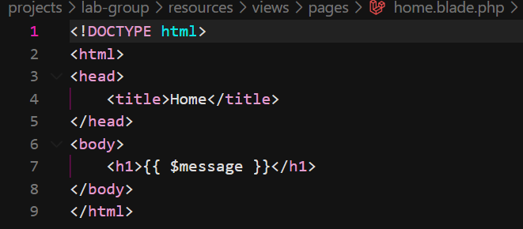
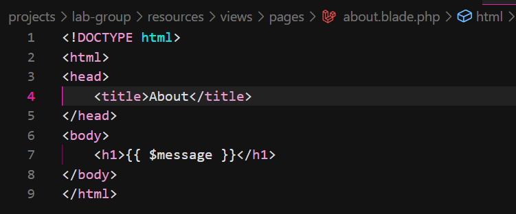
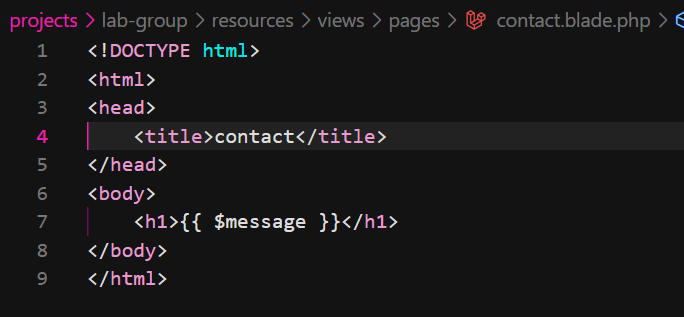

5. Jalankan aplikasi dan coba dengan beberapa input berbeda.

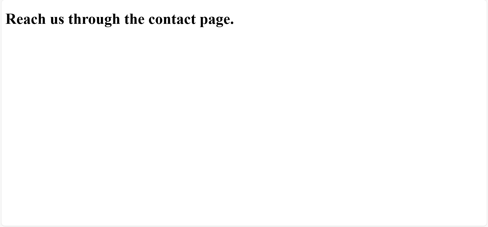

2.3 Praktikum 3 – Pengelompokan Prefix dengan Namespace Rute di Laravel 12

1. Buat dan Buka Proyek Laravel
composer create-project laravel/laravel:^12.0.3 lab-prefix
cd lab-prefix
code .

2. Buat folder dan dua controller menggunakan Artisan:
php artisan make:controller Admin/DashboardController
php artisan make:controller Admin/UserController

3. Definisikan Rute dengan Prefix dan Namespace Controller, edit routes/web.php

4. Tambahkan Aksi ke Controller
- mengembalikan view dengan pesan selamat datang. Berikut kode untuk DashboardController.php:

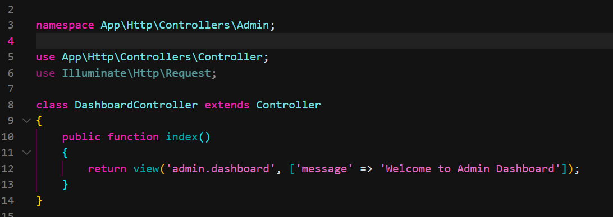

- mengembalikan daftar pengguna. Berikut kode untuk UserController.php:

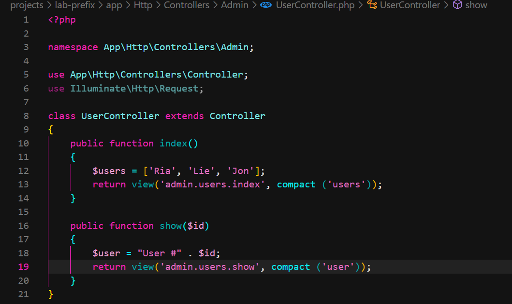

5. Buat View Sederhana, buat folder dan file di bawah resources/views/admin/. Kemudian, buat file-file berikut: dashboard.blade.php, users/index.blade.php, users/show.blade.php

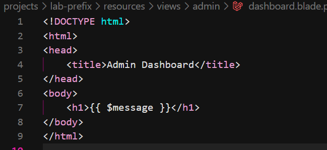
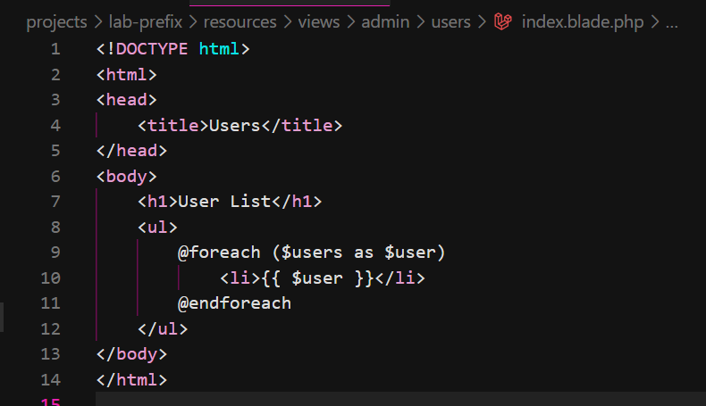
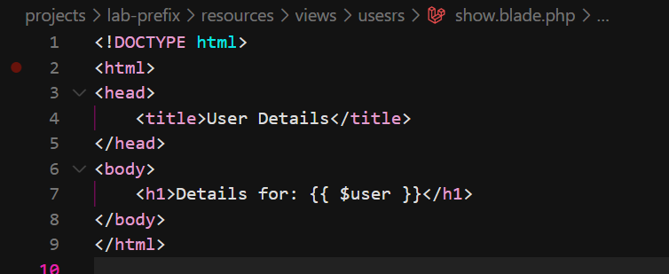

6. Jalankan aplikasi dan coba dengan beberapa input berbeda.

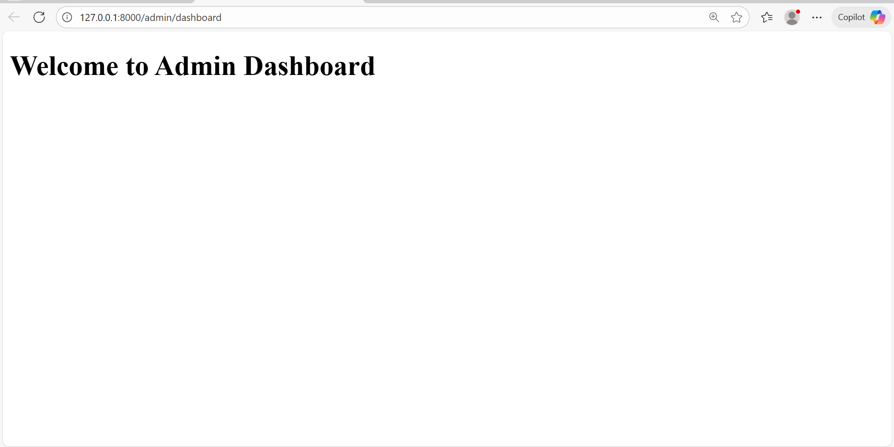
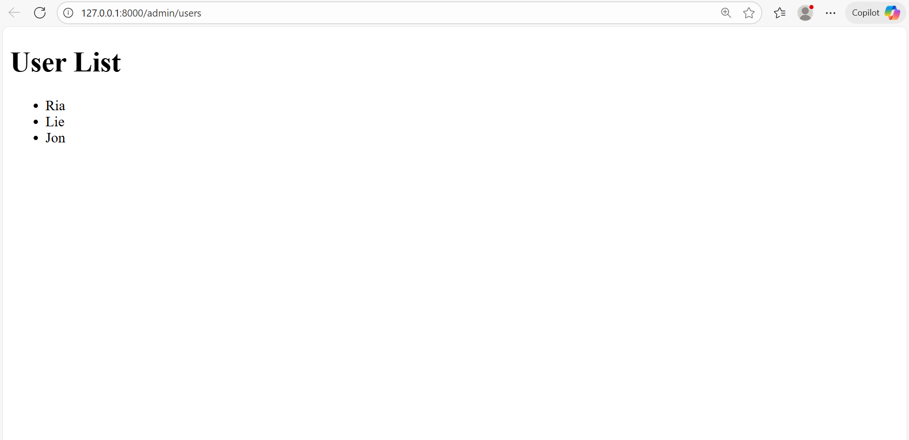
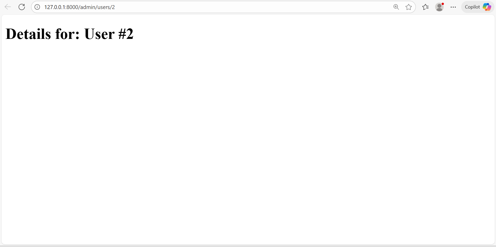

---

## 3. Hasil dan Pembahasan

Praktikum 1: 
Controller bisa menampilkan halaman sesuai dengan input dari pengguna, seperti halaman hello, greet, dan search.

Praktikum 2: 
Dengan group route, beberapa halaman seperti home, about, dan contact bisa dikelola dalam satu controller, sehingga kode jadi lebih rapi dan mudah diatur.

Praktikum 3: 
Penggunaan prefix dan namespace membantu memisahkan bagian admin dan user. Controller seperti DashboardController dan UserController bisa menampilkan halaman dashboard, index, dan show dengan baik.

---

## 4. Kesimpulan

Controller di Laravel berfungsi untuk menghubungkan antara route, model, dan view.
Dengan bantuan group route, prefix, dan namespace, struktur proyek menjadi lebih teratur dan mudah dipahami.
Selain itu, penting untuk memperhatikan penamaan dan letak file view agar tidak terjadi error saat program dijalankan.

---

## 5. Referensi
1. peran utama controller https://baraka.uma.ac.id/mengenal-controller-pada-laravel-pusat-kendali-aplikasi-web/

---
