# Laporan Modul 4: Form Submission & Data Validation
**Mata Kuliah:** Workshop Web Lanjut   
**Nama:** Maisha Zahrani
**NIM:** 2024573010052 
**Kelas:** TI-2C

---

## Abstrak 
Form submission dan data validation merupakan bagian penting dalam pengembangan aplikasi web. Laravel menyediakan fitur lengkap untuk mengatur input pengguna, melakukan validasi data, serta memberikan respon yang sesuai. Dengan keamanan seperti CSRF protection dan sistem validasi yang fleksibel, Laravel membantu pengembang membangun aplikasi yang aman, efisien, dan ramah pengguna.

---

## 1. Dasar Teori
Apa itu Form Submission dan Data Validation?
Form submission dan validasi data merupakan komponen krusial dalam pengembangan aplikasi web modern. Laravel menyediakan sistem yang robust dan elegant untuk menangani input pengguna, memvalidasi data, dan memberikan feedback yang informatif. Sistem ini dirancang dengan prinsip keamanan, kemudahan penggunaan, dan fleksibilitas.

Proses Form Submission di Laravel mengikuti konsep MVC (Model-View-Controller):
1. View berfungsi menampilkan form HTML kepada pengguna.
2. Controller menerima data dari form dan memprosesnya.
3. Model berinteraksi dengan database untuk menyimpan atau mengambil data.
4. Request membawa data dari client ke server, sedangkan Response mengembalikan hasil pemrosesan ke pengguna.

Laravel mendukung beberapa HTTP Method seperti POST, PUT, PATCH, DELETE, dan GET. Karena HTML hanya mendukung GET dan POST, Laravel menggunakan method spoofing dengan direktif @method('PUT') agar dapat meniru method lain.

Alur Form Submission secara umum:
1. Pengguna mengisi form dan menekan tombol submit.
2. Browser mengirimkan request ke route yang sudah ditentukan.
3. Middleware Laravel memproses request (termasuk pengecekan CSRF token).
4. Controller melakukan validasi data.
5. Jika validasi berhasil, data akan disimpan; jika gagal, Laravel mengembalikan pesan error.
6. Hasilnya dikirim kembali ke pengguna melalui response.

CSRF Protection (Cross-Site Request Forgery) berfungsi mencegah pengguna tanpa sadar mengirim permintaan berbahaya. Laravel melindungi setiap form dengan CSRF token unik yang disertakan melalui @csrf. Token ini akan dibandingkan dengan token di session, dan jika tidak cocok maka request akan ditolak (error 419).

Validasi Data penting untuk menjaga keamanan dan kualitas aplikasi.
Validasi memastikan data yang dikirim pengguna sesuai aturan, mencegah kesalahan logika, dan melindungi aplikasi dari serangan seperti SQL Injection atau XSS. Laravel menyediakan beberapa cara untuk melakukan validasi:
1. Controller Validation menggunakan $request->validate([...]) langsung di controller.
2. Form Request Validation menggunakan class khusus untuk memisahkan aturan validasi.
3. Manual Validation menggunakan Validator::make() untuk kontrol yang lebih detail.

Kategori Aturan Validasi di Laravel cukup beragam:
1. Basic Rules: required, nullable, filled, sometimes
2. Tipe Data: string, numeric, integer, boolean, file, array
3. Ukuran: min, max, between, size
4. Database: unique, exists
5. Format: email, url, ip, date, regex
6. Perbandingan: confirmed, same, different
7. Kondisional: required_if, required_with, required_unless, dan lain-lain

Saat validasi gagal, Laravel secara otomatis membuat Error Bag berisi pesan kesalahan untuk tiap field. Pesan error ini bisa ditampilkan di view dengan:
1. @error('field') untuk menampilkan error per field.
2. $errors->all() untuk menampilkan semua pesan error sekaligus.
3. $errors->has('field') untuk mengecek error tertentu.

Laravel juga menyediakan fungsi old() agar input sebelumnya tetap muncul setelah validasi gagal. Ini membantu pengguna tidak perlu mengetik ulang data yang sudah diisi sebelumnya. Pesan error bawaan Laravel bisa diganti dengan custom message agar lebih mudah dimengerti pengguna. Selain itu, developer juga bisa membuat aturan validasi kustom, baik dengan class rule sendiri (misal Uppercase) maupun dengan closure validation langsung di controller.

---

## 2. Langkah-Langkah Praktikum
Tuliskan langkah-langkah yang sudah dilakukan, sertakan potongan kode dan screenshot hasil.

2.1 Praktikum 1 – Menangani Request dan Response View di Laravel 12

1. Buat dan Buka Proyek Laravel
laravel new form-app
cd form-app
code .

2. Definisikan Rute, edit routes/web.php

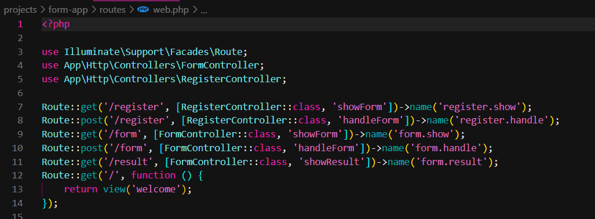

3. Buat controller untuk menangani logika form. php artisan make:controller FormController
Ini akan membuat file controller baru di app/Http/Controllers/FormController.php. Buka file ini dan tambahkan metode berikut:

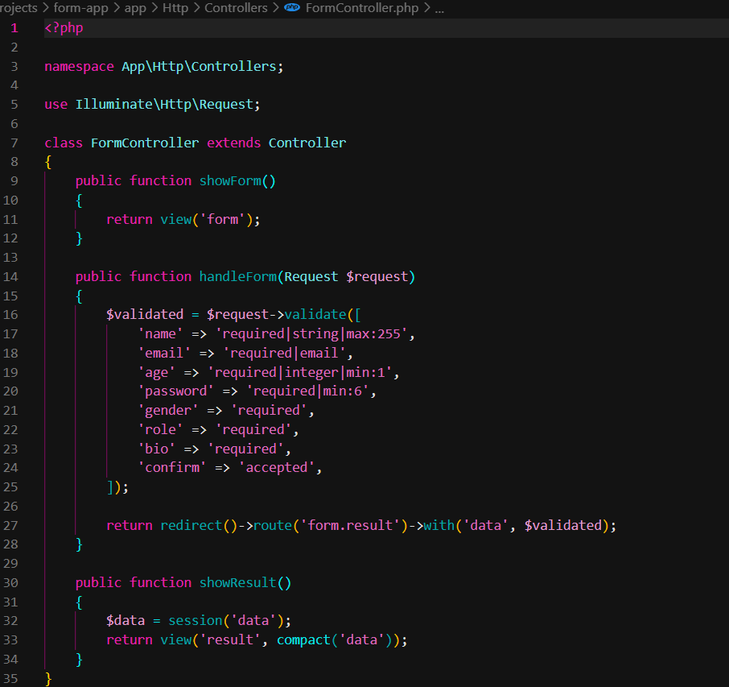

4. Buat View Form
Buat file view Blade baru untuk form. Buat direktori bernama form di dalam resources/views dan buat file bernama form.blade.php di dalamnya.

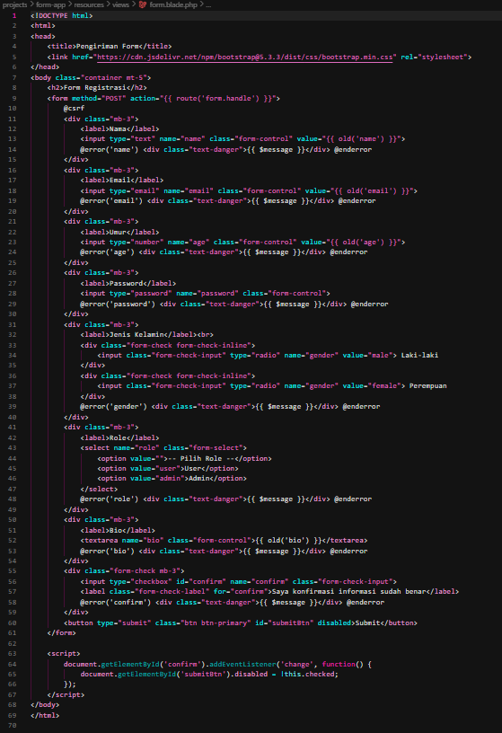

Buat View Hasil
Buat file view Blade baru untuk menampilkan hasil. Buat file bernama result.blade.php di dalam direktori resources/views dan isikan kode berikut:

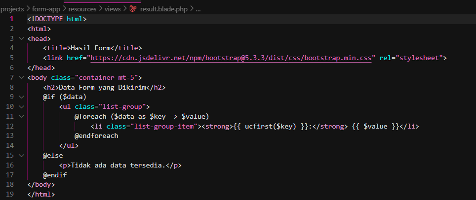

5. Jalankan Aplikasi: php artisan serve

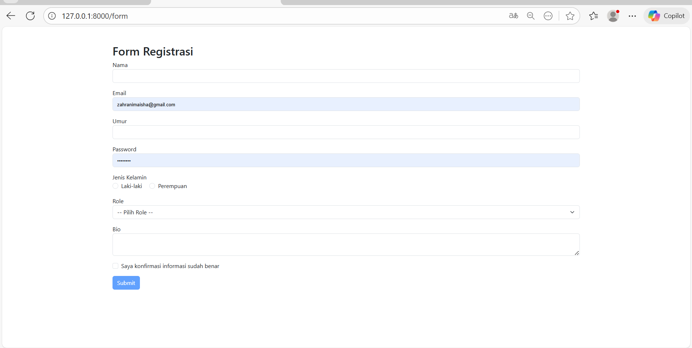

2.2 Praktikum 2 – Validasi Kustom dan Pesan Error di Laravel 12

1. Mendifiniskan Route
Buka project praktikum 1 sebelumnya, kemudian tambahkan route baru berikut:

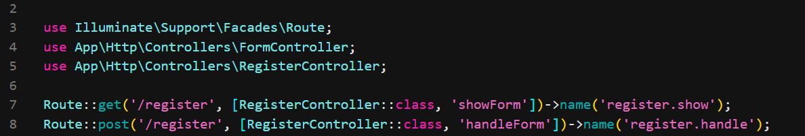

2. Buat sebuah Controller baru: php artisan make:controller RegisterController
Lihat file controller baru di app/Http/Controllers/RegisterController.php. Buka file ini dan tambahkan metode berikut:

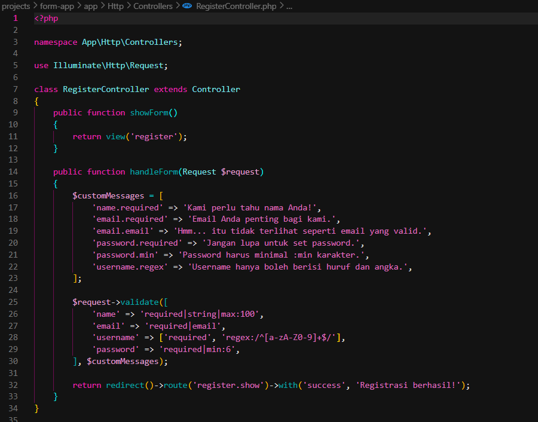

3. Buat View
Buat file view Blade baru untuk form. Buat file bernama register.blade.php di dalam direktori resources/views dan isikan kode berikut:

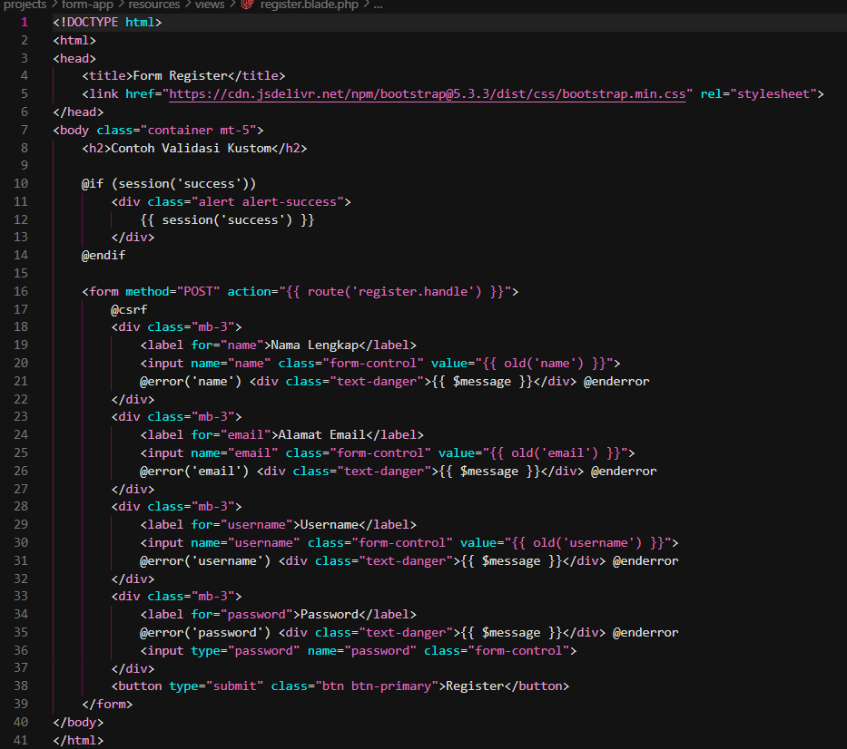

4. Jalankan Aplikasi

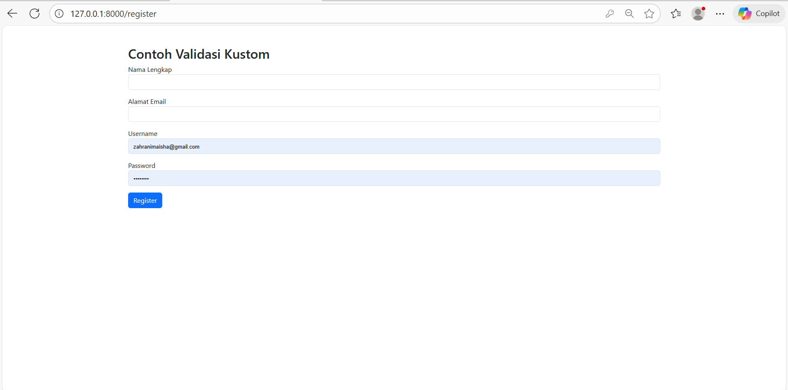

2.3 Praktikum 3 –  Multi-Step Form Submission dengan Session Data

1. Buat dan Buka Proyek Laravel
laravel new multistep-form-app
cd multistep-form-app
code .

2. Buat file layout di resources/views/layouts/app.blade.php:

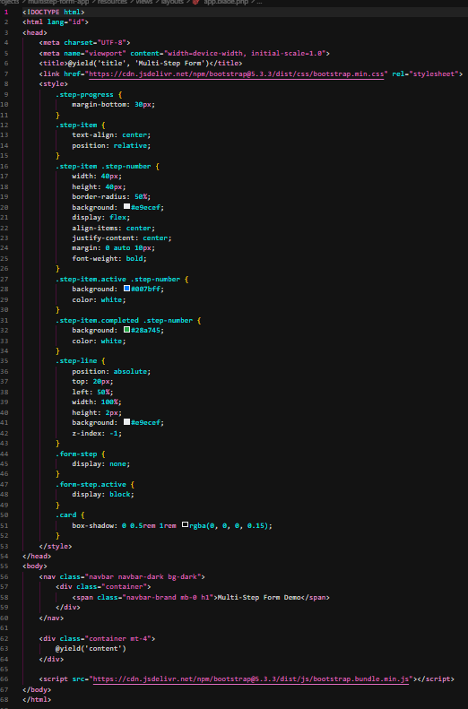

3. Buat Routes

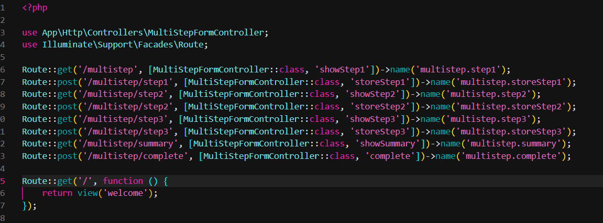

4. Buat controller untuk menangani logika multi-step form: php artisan make:controller MultiStepFormController
Buka file app/Http/Controllers/MultiStepFormController.php dan tambahkan metode berikut:

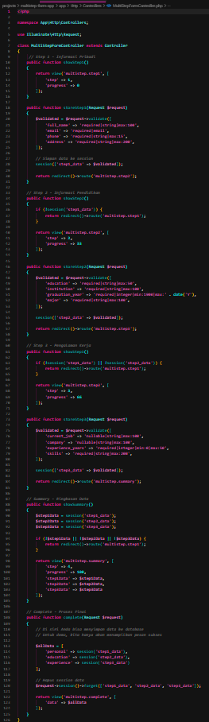

5. Buat Views untuk Setiap Step
Buat direktori resources/views/multistep/
Step 1 - Informasi Pribadi: resources/views/multistep/step1.blade.php

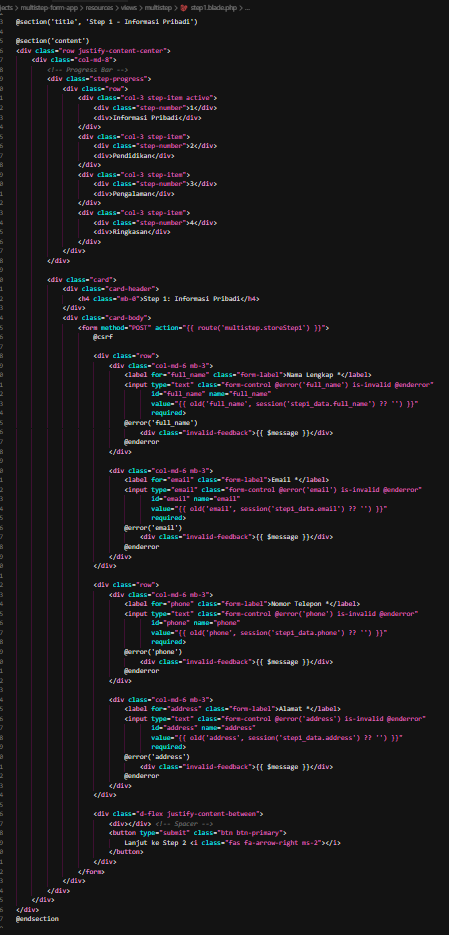

Step 2 - Informasi Pendidikan: resources/views/multistep/step2.blade.php

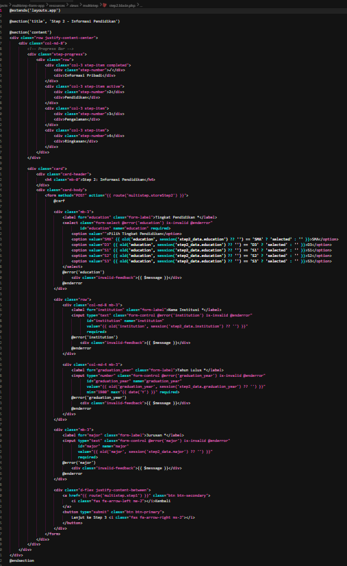

Step 3 - Pengalaman Kerja: resources/views/multistep/step3.blade.php

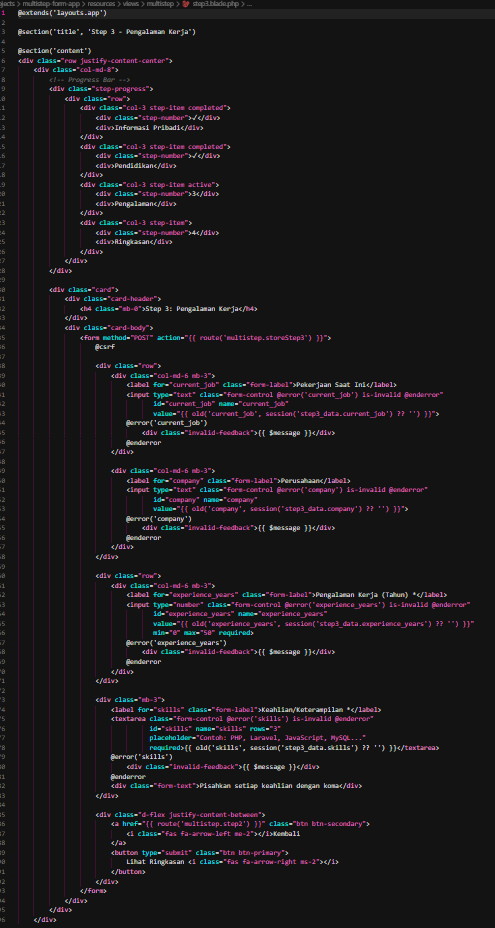

Summary - Ringkasan: resources/views/multistep/summary.blade.php

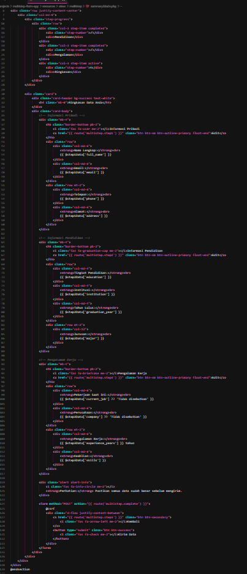

Complete - Selesai: resources/views/multistep/complete.blade.php

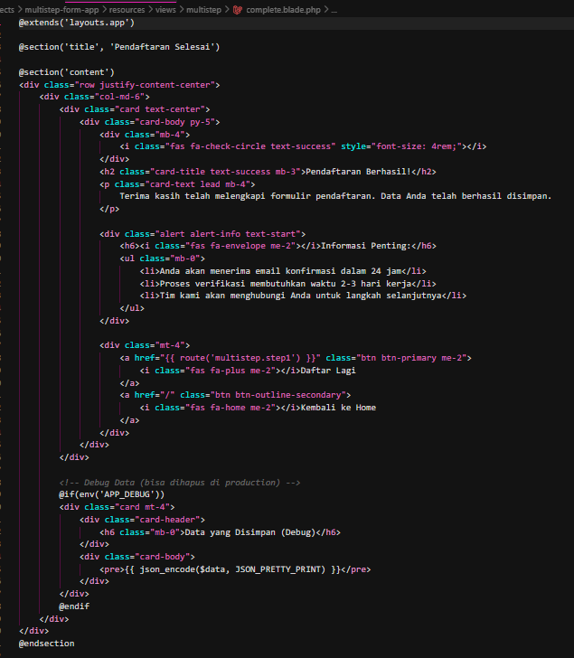

5. Jalankan Aplikasi: php artisan serve

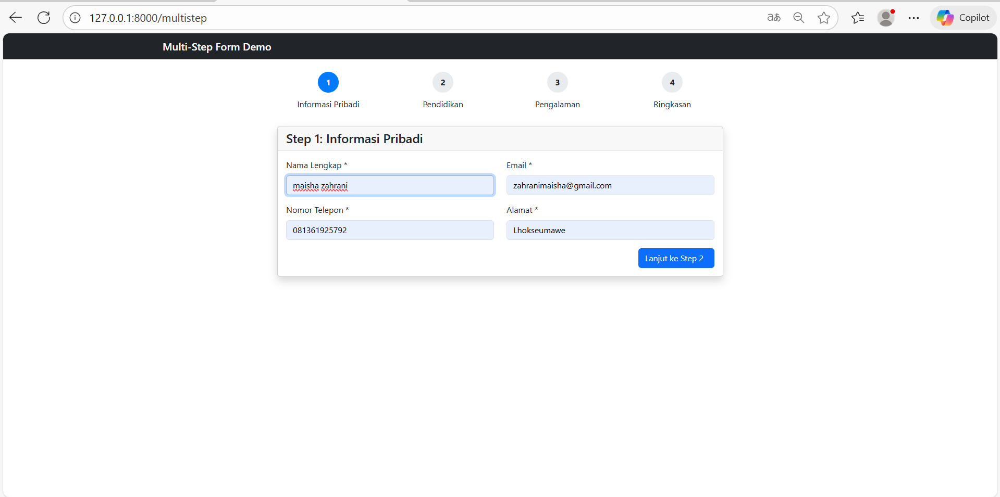
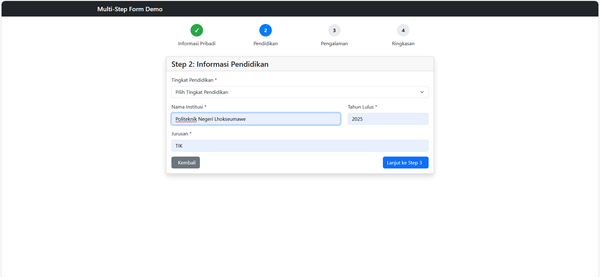
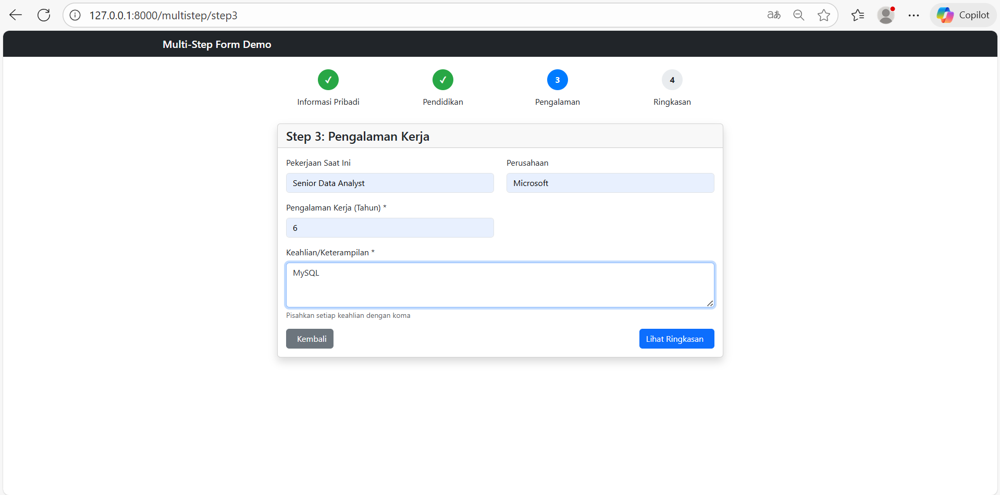
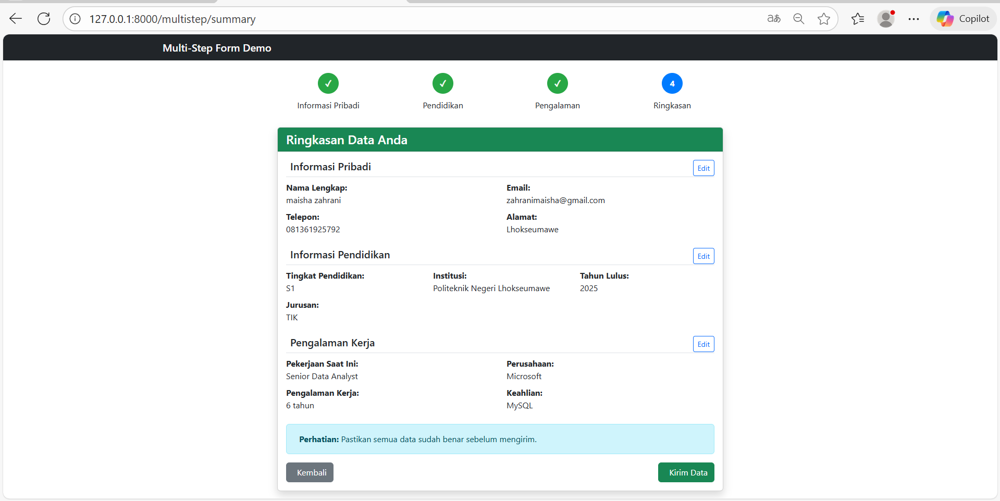
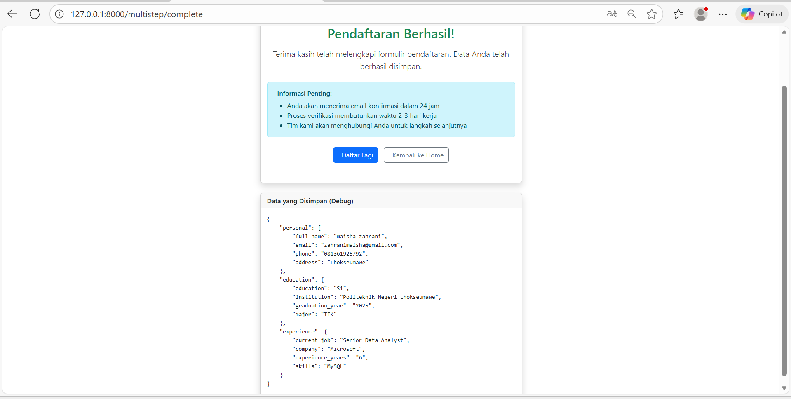

---

## 3. Hasil dan Pembahasan
Pada percobaan pertama, form bisa menampilkan data yang dikirim pengguna lewat controller dan view sesuai alur kerja Laravel.

Pada percobaan kedua, validasi berhasil mengecek data dengan benar dan menampilkan pesan error saat ada input yang salah. Data yang sudah diketik juga tetap muncul setelah validasi gagal, jadi pengguna tidak perlu mengisi ulang.

Pada percobaan ketiga, form bertahap (multi-step) bisa dijalankan dengan lancar. Data dari setiap langkah tersimpan di session dan ditampilkan lagi di bagian ringkasan sebelum dikirim.

---

## 4. Kesimpulan
Laravel memiliki sistem form submission dan data validation yang lengkap, aman, dan mudah digunakan. Melalui konsep MVC, Laravel mampu memisahkan proses input, validasi, dan penyimpanan data dengan rapi. Fitur seperti CSRF Protection, error handling, dan custom validation menjadikan Laravel sangat efisien untuk membangun aplikasi web yang aman dan terstruktur. Dengan memanfaatkan fitur ini, developer dapat memastikan setiap data yang masuk ke aplikasi sudah tervalidasi dengan baik dan bebas dari kesalahan.

---

## 5. Referensi
1. https://hackmd.io/@mohdrzu/r1AIUzWpll
2. https://chatgpt.com
---
